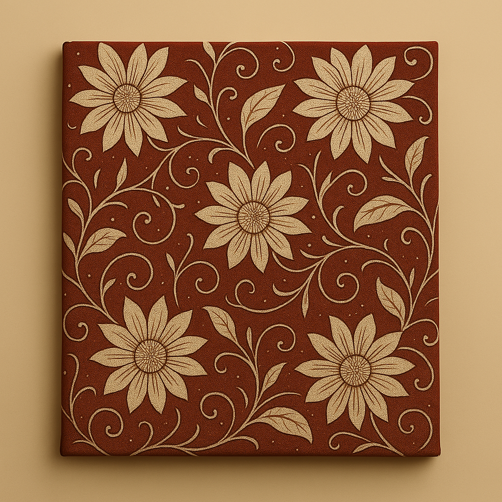

# Abunas Textiles Landing Page

Welcome to the **Abunas Textiles Landing Page** project! This is a modern, responsive landing page for a fictional African textile store, created as part of [The Odin Project](https://www.theodinproject.com/) curriculum. The page showcases a curated collection of handcrafted fabrics, patterns, and designs, celebrating the rich heritage and artistry of African textiles.

---

## Table of Contents

- [Demo](#demo)
- [Features](#features)
- [Screenshots](#screenshots)
- [Getting Started](#getting-started)
- [Project Structure](#project-structure)
- [Technologies Used](#technologies-used)
- [Credits](#credits)
- [License](#license)

---

## Demo

You can view the landing page by opening [`index.html`](index.html) in your browser.

---

## Features

- **Modern Responsive Design:** Adapts seamlessly to desktop, tablet, and mobile screens.
- **Hero Section:** Welcoming introduction with a call-to-action button and a vibrant hero image.
- **Product Showcase:** Highlights four unique textile products with images and descriptions.
- **Inspirational Quote:** Features a quote about the cultural significance of textiles.
- **Call to Action:** Encourages visitors to sign up for updates and offers.
- **Accessible Navigation:** Simple and clear navigation bar for easy browsing.
- **Clean, Readable Code:** Well-structured HTML and CSS for maintainability and learning.

---

## Screenshots

> _All images used in this project were generated by Copilot AI._

- **Hero Section:**  
  

- **Product Showcase:**  
  
  
  
  

---

## Getting Started

To run this project locally:

1. **Clone the repository:**
   ```sh
   git clone <your-repo-url>
   cd Project-Landing-Page
   ```

2. **Open the project:**
   - Open the folder in [Visual Studio Code](https://code.visualstudio.com/) or your preferred editor.

3. **View the landing page:**
   - Open [`index.html`](index.html) in your web browser.

No build tools or dependencies are required—everything is pure HTML and CSS.

---

## Project Structure

```
Project-Landing-Page/
│
├── app.css                # Main stylesheet
├── index.html             # Main HTML file
├── README.md              # Project documentation
├── img/                   # Image assets (all generated by Copilot AI)
│   ├── hero-section-img.png
│   ├── product-1.png
│   ├── product-2.png
│   ├── product-3.png
│   └── product-4.png
└── .dist/                 # (Optional) Distribution/build output
```

---

## Technologies Used

- **HTML5:** Semantic markup for structure and accessibility.
- **CSS3:** Modern layout techniques (Flexbox, media queries) for responsive design.
- **No JavaScript:** This project is intentionally built without JavaScript for simplicity.

---

## Credits

- **Images:**  
  All images in the [`img/`](img/) directory were generated by Copilot AI.

- **Inspiration:**  
  This project was inspired by [The Odin Project](https://www.theodinproject.com/) curriculum.

---

## License

This project is open source and available under the [MIT License](LICENSE).

---

**Happy coding!**